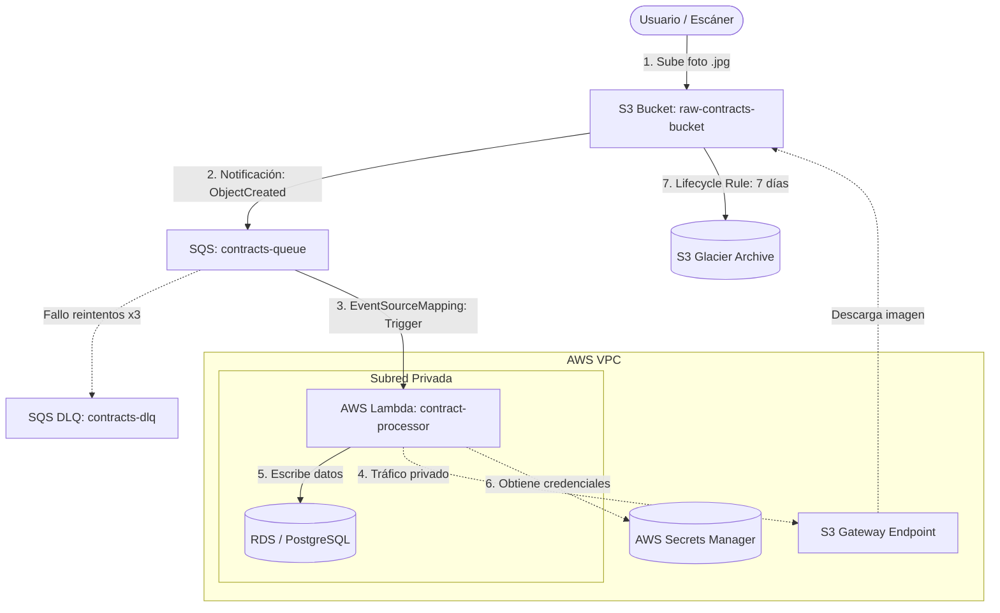

# Arquitectura — Ingestador de Contratos Serverless

## Diagrama

*Ver [plan-de-migracion.md](plan-de-migracion.md) para más detalles del plan de tiempos y Gantt.*

## Componentes

| Componente local | Equivalente cloud | Identidad / credencial |
|---|---|---|
| Contenedor LocalStack S3 | Amazon S3 | AWS IAM S3 Bucket Policy |
| Contenedor LocalStack SQS | Amazon SQS | SQS Queue Policy |
| Contenedor Docker Lambda | AWS Lambda | AWS IAM Role `contract-processor-role` |
| Contenedor PostgreSQL | Amazon RDS PostgreSQL | VPC Security Groups |
| LocalStack Secrets Manager | AWS Secrets Manager | AWS KMS / Secrets Policy + IAM Role |
| Docker network default | AWS VPC / Private Subnet | VPC Route Tables |
| - | S3 Gateway Endpoint | VPC Route Table entry |

## Puntos únicos de falla identificados

| SPOF | Mitigación en cloud |
|---|---|
| Caída de la base de datos RDS | Configuración de **RDS Multi-AZ** con failover automático a réplica pasiva. |
| Eliminación accidental / Ransomware en contratos | Activar **S3 Versioning** y **S3 Glacier Vault Lock** con retención legal WORM inmutable. |
| Ingesta masiva concurrente de fotos | Cola AWS SQS intermedia (`aws_sqs_queue.contracts_queue`) y una Dead Letter Queue (DLQ) para amortiguar carga, limitar la concurrencia y controlar reintentos sin saturar la BD. |
| Desvíos financieros o descontrol de costos | Implementar **AWS Budgets** mensuales y una **Alarma de Facturación de CloudWatch** (`EstimatedCharges`) vinculada a **Amazon SNS** para alertas proactivas. |

## Decisiones de Identidad e Integración

- **Autenticación entre servicios:** La función Lambda se ejecuta con un rol de IAM específico (`contract-processor-role`) que le otorga permisos temporales mediante STS para leer de la cola SQS, descargar objetos del bucket de S3, escribir logs en CloudWatch y consultar Secrets Manager.
- **Acceso a base de datos:** El Host, Usuario y Contraseña de Postgres/RDS se inyectan en Lambda en tiempo de ejecución de forma segura desde AWS Secrets Manager, evitando credenciales hardcodeadas en variables de entorno en texto plano.
- **Permisos S3 y SQS:** El bucket cuenta con una S3 Bucket Policy restrictiva y la cola SQS con una SQS Policy que limita la recepción de eventos únicamente a tráficos autorizados de la VPC y del propio bucket.
- **Mecanismo de Disparo (Trigger):** Se implementa una integración desacoplada asíncrona: S3 envía eventos a la cola `aws_sqs_queue.contracts_queue`, y SQS invoca a la Lambda mediante un Event Source Mapping. Los mensajes fallidos son derivados a la DLQ (`aws_sqs_queue.contracts_dlq`) después de 3 reintentos fallidos, protegiendo la disponibilidad de la base de datos PostgreSQL.

