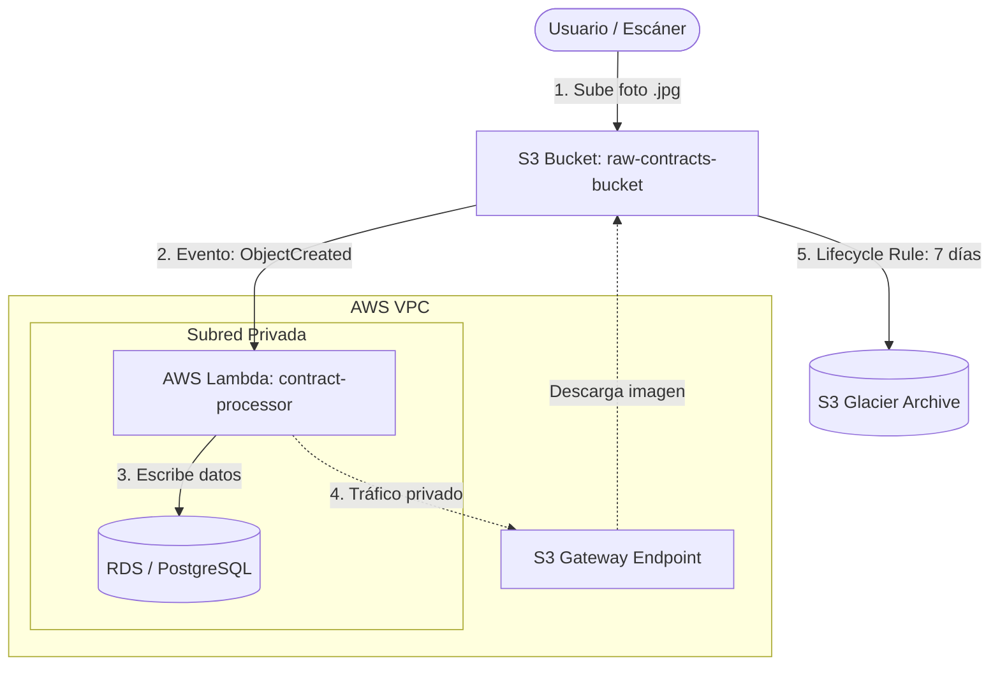
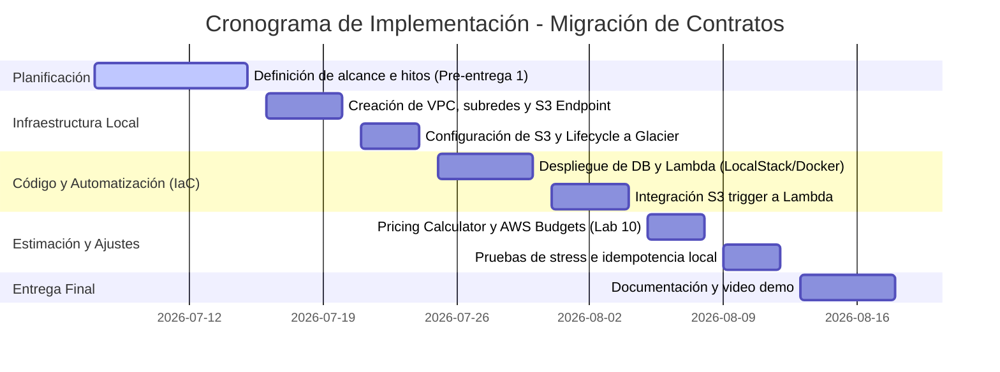

# Plan de Migración: Ingesta y Procesamiento Automatizado de Contratos

---

## 1. Alcance y Objetivos (Pre-entrega N°1)

### 📌 Resumen de la Feature / Componente
El proyecto consiste en diseñar y aprovisionar de forma 100% reproducible la infraestructura necesaria para una **feature serverless orientada a eventos**. Esta feature automatiza la ingesta, procesamiento OCR de metadatos y almacenamiento estructurado de contratos digitalizados de la empresa.

### 🎯 Objetivos SMART
*   **S (Específico):** Automatizar el procesamiento de archivos de imagen de contratos subidos a un bucket de S3, disparando una función Lambda que extraiga la información relevante del texto (simulado) y la almacene en una base de datos relacional protegida, archivando la imagen original en S3 Glacier.
*   **M (Medible):** Garantizar que el 100% de los recursos necesarios de cómputo, red, almacenamiento y seguridad se desplieguen y se destruyan mediante un único comando de OpenTofu/Terraform en local (idempotencia y reproducibilidad).
*   **A (Alcanzable):** Construido sobre LocalStack Community emulando los servicios S3, Lambda, VPC e IAM. La base de datos RDS se emulará mediante un contenedor PostgreSQL integrado en la misma red de Docker.
*   **R (Relevante):** Resuelve el problema común de procesar archivos de contratos de forma desacoplada y segura, asegurando políticas de menor privilegio (IAM) y protección de red (VPC).
*   **T (Temporal):** Completar y defender la solución reproducible antes de la fecha final del curso (Agosto 2026).

---

## 2. Diagrama de Arquitectura Física y Lógica

### Componentes de Infraestructura Aprovisionados

| Componente Físico / Lógico | Servicio AWS Equivalente | Rol / Credencial Asociada |
| :--- | :--- | :--- |
| **Storage de Contratos** | `aws_s3_bucket` | Reglas de ciclo de vida para archivar a Glacier a los 7 días. |
| **Cómputo Serverless** | `aws_lambda_function` | Rol IAM con permisos de lectura S3 y escritura de logs y base de datos. |
| **Base de Datos** | `aws_db_instance` (emulado PostgreSQL) | Aislado en subred privada VPC. Acceso mediante Security Groups. |
| **Canal de Red Privada** | `aws_vpc` + `aws_subnet` | Subred privada para Lambda y Base de Datos. |
| **Optimización de Costos** | `aws_vpc_endpoint` (S3 Gateway) | Ruteo interno de Lambda a S3 sin usar NAT Gateways (costo USD 0). |

---

## 3. Cronograma de Implementación (Gantt)

---

## 4. Estrategia de Mitigación de Puntos Únicos de Falla (SPOF) y Seguridad

| Punto de Falla (SPOF) / Riesgo | Impacto | Mitigación en Producción AWS |
| :--- | :--- | :--- |
| **Pérdida o Modificación de Contratos Históricos** | Violación de cumplimiento legal o regulaciones. | - Configurar **S3 Glacier Vault Lock** con una política inmutable (bloqueo WORM) de retención por 7 años. - Activar **S3 Versioning** para recuperar archivos ante sobrescrituras accidentales o ataques de ransomware. |
| **Caída o Fallo de la Base de Datos RDS** | Pérdida de acceso a los metadatos calientes y reportes. | Configurar despliegue **RDS Multi-AZ** con replicación síncrona y failover automático para garantizar alta disponibilidad de las consultas del negocio. (Las imágenes en S3 no se replican activamente, sino que se archivan a Glacier para reducir costos). |
| **Saturación en Ingesta de Fotos** | Pérdida de llamadas a Lambda. | Interponer una cola **AWS SQS** entre S3 y Lambda para amortiguar picos de carga y gestionar reintentos de procesamiento de forma asíncrona. |
| **Exposición de Credenciales / Ataques de Red** | Acceso no autorizado a los archivos del bucket. | - Restringir el acceso al bucket mediante una **S3 Bucket Policy** que solo permita tráfico originado desde el **S3 Gateway Endpoint** de la VPC (`aws:sourceVpce`). - Utilizar un **Rol IAM de ejecución restrictivo** asignado a Lambda con privilegios limitados al ARN exacto del bucket. |
| **Desvíos Financieros / Recursos Olvidados** | Factura mensual elevada por descuidos. | - Configurar un **AWS Budget** mensual con alertas al 80% (gasto real y proyectado). - Implementar una **Alarma de Facturación de CloudWatch** (`Billing Alarm` en us-east-1 sobre la métrica `EstimatedCharges`) vinculada a un tópico de **Amazon SNS** para enviar notificaciones push urgentes por correo o Slack. |

